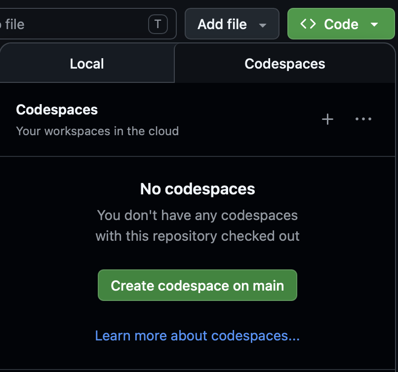

# 2026 Calphad Workshop

## Agenda

* 13:00 Opening and Introductions
* 13:15 PyCalphad
* 14:15 ESPEI
* 15:15 Break
* 15:30 Kawin
* 16:30 Discussion and Q&A
* 17:00 Closing

## Setup

### GitHub Codespaces (recommended)



### Local install

For local installs reccomend using [`uv`](https://docs.astral.sh/uv/) to install and manage your virtual environment.
If you don't already have `uv` installed:

```shell
# macOS / Linux
curl -LsSf https://astral.sh/uv/install.sh | sh
```

```powershell
# Windows
powershell -ExecutionPolicy ByPass -c "irm https://astral.sh/uv/install.ps1 | iex"
```

The following then downloads this repo, adds the packages, and creates a Jupyter kernel for you
```shell
git clone https://github.com/materialsgenomefoundation/2026-calphad-workshop.git
cd 2026-calphad-workshop
uv sync
uv run python -m ipykernel install --user --name=workshop
```